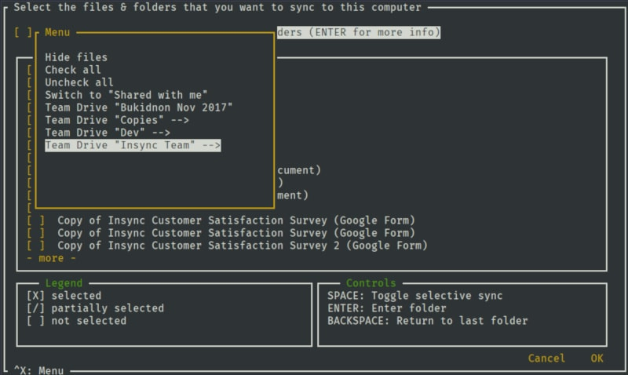

# insync_manual
instructions for synchronizing Google Disk with the server, with using insync tool.

***

* go to the server and install insync (for ubuntu)
>curl -L -o insync-headless.deb https://cdn.insynchq.com/builds/linux/insync-headless_3.2.7.10758-buster_amd64.deb

>apt-get install ./insync-headless.deb

* start insync
>insync-headless start

* create a directory where files from google drive will be saved
>mkdir google-drive

* we alse need Auth Code from Google, get it from the link:
https://connect.insynchq.com/auth?cloud=gd

* now we need to add our google account. for help, you can enter the command `insync-headless account add`
>insync-headless account add -a `Auch Code` -c gd -p ./google-drive -e MS_OFFICE

* it remains to select the files to be synchronized
>insync-headless selective-sync

 a window will open, you can use the arrows to navigate, press the space bar to select. To confirm your choice, press Tab.
 You can press Ctrl + x, in the window that opens, select check all - this way you select all the files.
