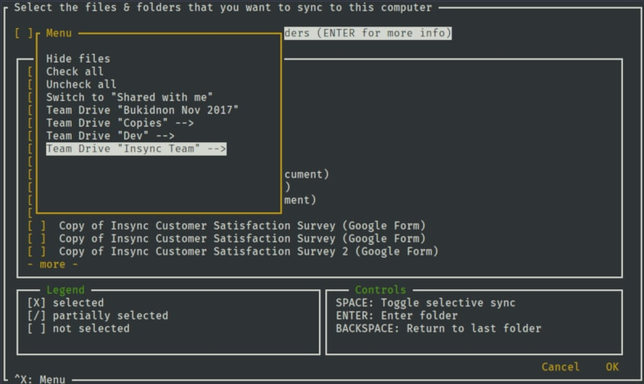

# insync_manual
Инструкция по синхронизации Google Disk с сервером, используя инструмент insync.
Предполагается что вы знаете базовые команды терминала Linux.

***

* Заходим на наш сервер и устанавливаем insync (я использую ubuntu)
>curl -L -o insync-headless.deb https://cdn.insynchq.com/builds/linux/insync-headless_3.2.7.10758-buster_amd64.deb

>apt-get install ./insync-headless.deb

* Запумкаем инструмент insync
>insync-headless start

* Создаем директорию, в которую будут загружаться файлы с Google Disc.
>mkdir google-drive

* Нам понадобится код аутентификации от Google, его можно получить по ссылке:
https://connect.insynchq.com/auth?cloud=gd

* Теперь нам нужно добавить данные в insync
 Дополнительную справку можно получить введя команду `insync-headless account add`.
 В своем примере я добавил конфигурацию слудующего рода:
>insync-headless account add -a `Auch Code` -c gd -p ./google-drive -e MS_OFFICE

* Осталось выбрать файлы для синхронизиции
>insync-headless selective-sync

 Откроется окно, для навигации можно использовать стрелки. Нажмите пробел чтобы выбрать файл. Tab для подтверждения выбора.
 Вы можете нажать Ctrl + x, для вызова меню с опциями. check all - отметит все файлы.
